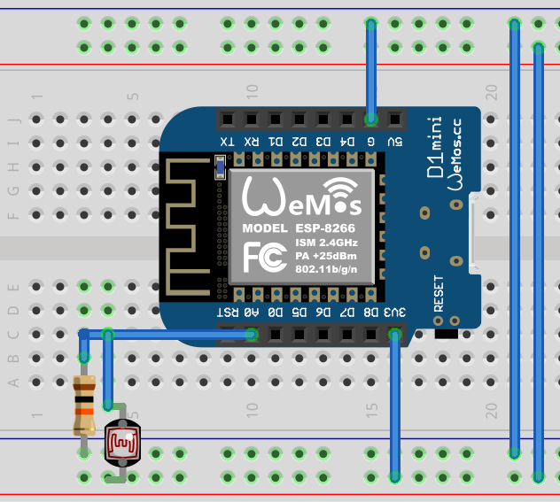

# mupplets [WIP]

muwerk applets: functional units that support specific hardware or reusable applications

| mupplet     | Function | Hardware | Dependencies |
| ----------- | -------- | -------- | ------------ |
| airqual.h   | Air quality sensor Co2, VOC | CS811 | [SparkFun CCS811 Arduino Library](https://github.com/sparkfun/SparkFun_CCS811_Arduino_Library) |
| clock7seg.h | Simple 4 digit clock with timer | 4x 7segment display xxx | [Adafruit GFX Library](https://github.com/adafruit/Adafruit-GFX-Library) [Adafruit LED Backpack Library](https://github.com/adafruit/Adafruit_LED_Backpack) |
| dhtxx.h     | Temperature, humidity sensor | DHT 11, DHT 22 | DHT sensor library |
| ldr.h       | Luminosity | Analog  portLDR: (-)--[10k]--[A-in]--[LDR]--(Vcc) | |
| led.h       | LED diode | Digital out or PWM connected to led: [D-out]--[led<]--(Vcc) | |
| lumin.h     |
| neocandle.h |
| pressure.h  |
| switch.h    |

## ldr.h

{:height="50%" width="50%"}
